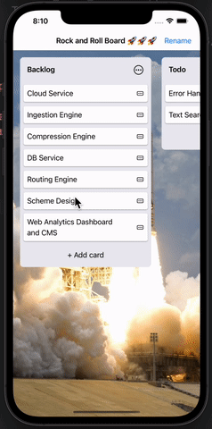

# Trello-MVVM-SwiftUI
A simple drag and drop Trello like task manager in SwiftUI. THIS IS V1, MORE FEATURES WILL BE ADDED IN FUTURE VERSIONS

## Summary
This is a clone of basic Trello for task tracking and adding

## Built With
* [SwiftUI](https://developer.apple.com/tutorials/swiftui)
* [UIKit](https://developer.apple.com/documentation/uikit)

## Gif of App


## Installation Steps For Local Running
1. Clone project.
2. Open terminal
3. cd 'your-desired-path'
4. git clone 'paste-link-here'
5. open project in Xcode and run

## Code Snippet Of Getting Alert Making Edits
```swift
func presentAlertTextField(title: String, message: String? = nil, defaultTextFieldText: String? = nil, confirmAction: @escaping (String?) -> ()) {
        guard let rootVC = (UIApplication.shared.connectedScenes.first as? UIWindowScene)?
                .keyWindow?
                .rootViewController else { return }
        
        let alertController = UIAlertController(title: title, message: message, preferredStyle: .alert)
        alertController.addTextField { textField in
            textField.text = defaultTextFieldText
        }
        alertController.addAction(.init(title: "Cancel", style: .cancel) { _ in })
        alertController.addAction(.init(title: "Save", style: .default, handler: { _ in
            guard let textField = alertController.textFields?.first else { return }
            confirmAction(textField.text)
        }))
        rootVC.present(alertController, animated: true, completion: nil)
    }
```


## Author

* **Mehdi Safari**

- [Link to Github](https://github.com/mehdisafari77)
- [Link to LinkedIn](https://www.linkedin.com/in/mehdi-safari-992799142/)
